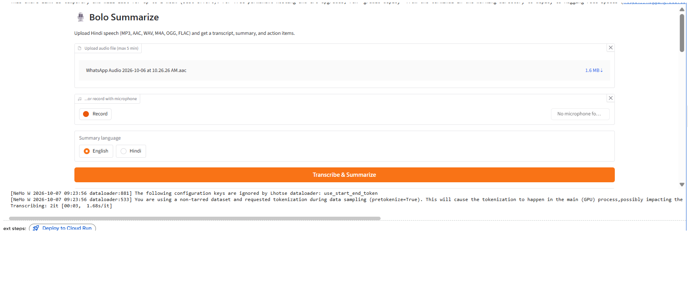

# 🎙️ Bolo Summarize

Upload Hindi speech and get a transcript, a structured summary, action items,
and key numbers and dates.

## How it works

Hindi audio → ffmpeg (16 kHz mono WAV, 30 s chunks) → Koyal ASR
(Automatic Speech Recognition) → LangChain + OpenAI LLM (Large Language Model)
→ structured summary (title, key points, action items, numbers and dates)

A Gradio UI (User Interface) lets anyone upload MP3, AAC, WAV, M4A, OGG or FLAC
files and get results by clicking.

## Run it

1. Open the notebook in Colab and select a T4 GPU (Graphics Processing Unit) runtime.
2. Accept the terms on the Koyal model page: adalat-ai/koyal-hi-120m-1.0
3. Add Colab Secrets (with Notebook access on): `HF_TOKEN` (a Hugging Face Read token) and `OPENAI_API_KEY`.
4. Run all cells. Gradio prints a temporary public link.

## Sample

See the `sample/` folder for an example transcript, summary and screenshot.

## Limitations

- ASR errors pass through to the summary. In my test, "परीक्षण" (testing) was
  heard as "प्रशिक्षण" (training), so the summary changed meaning. Review
  important outputs manually.
- Koyal is not trained on code-switched speech (Hindi mixed with English).
- The public link is temporary and only works while the notebook runs.
- Audio is limited to 5 minutes to control API costs.

## Credits

- Koyal Hindi ASR by Adalat AI (CC-BY-4.0): huggingface.co/adalat-ai/koyal-hi-120m-1.0
- Encoder base: MahaDhwani by AI4Bharat
- Built with NVIDIA NeMo, LangChain, OpenAI and Gradio
